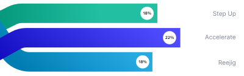

# rga-data-vis-coding-challenge

Welcome and thank you for taking this coding challenge. The goal of this challenge is to help us communicate an example 
of the data visualisation tasks you would frequently see. At R/GA we strive to deliver the best possible UI/UX to our 
clients and that sometimes involves creating data-vis which isn't standard and cannot be easily achieved through 
off-the-shelf libraries (at least as far as we know, please let us know if that's not the case). 

The Challenge
---

Your task is to create the above bar graph programatically and satisfy the following requirements:

* The number of lines can be reduced or increased. The last line is always intertwined. For simplicity 
you can assume there would be at least two lines. 
* The visualisation needs to be data driven. You can assume the zero on the x-axis starts after the lines
of the bar graph straighten. Which means a line which has a value of 0 will still have some presence on the graph
* **Bonus**: Animate an entrance for the lines from left to right, and the percentage on the graph. 

Submission
---
* The SVG for the graph is provided in this repository, feel free to use it as a guide for your graph. 
* You can use any library to achieve the results, we used d3 internally. 
* The produced graph must be rendered dynamically in a web browser and must not rely on any back-end 
tech. We will test it on Chrome 94. 
* The submission itself can be in convinient form like a GitHub repo or a CodePen. 
* We are looking into your thought process and approach more than the end result itself. If you are not 
able to complete the challenge in a reasonable time, that's okay! Just let us know what you have and what
you would like to do more. 
